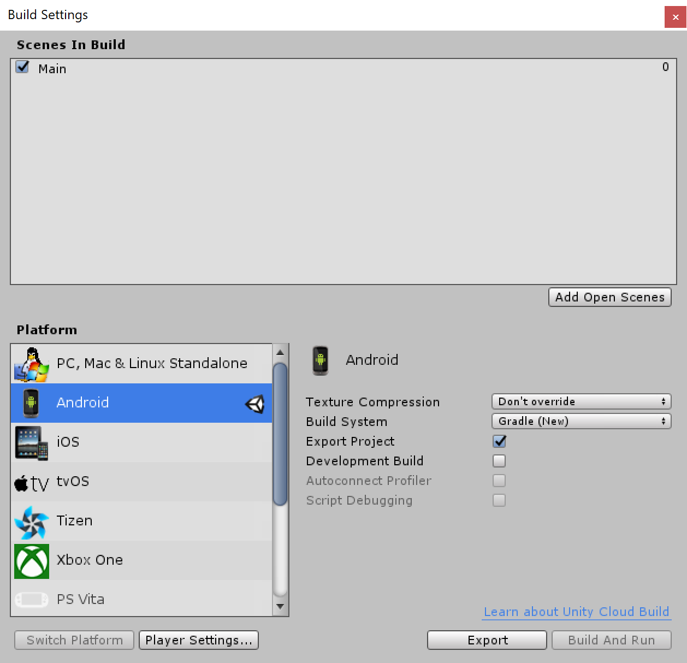

# **SDK for Unity 5.6.x**

## **Table of Content**
* [**Tools**](#Tools)
* [**Demo**](#Demo)
* [**Android Plugin**](#Android-Plugin)
    * [**Player Settings**](#Player-Settings)
    * [**Library**](#Library)
    * [**Android Manifest**](#Android-Manifest)
    * [**Gradle Build**](#Gradle-Build)
    * [**Export Project**](#Export-Project)
* [**Unity code**](#Unity-code)
    * [**SetEnvironment**](#SetEnvironment)
    * [**InitStartSDK**](#InitStartSDK)
    * [**IOnActivityResult**](#IOnActivityResult)
    * [**SignIn**](#SignIn)
    * [**SignOut**](#SignOut)
* [**Android Studio**](#Android-Studio)
* [**Q & A**](#Q-&-A)

### **Tools**

* [Unity **5.6.5p1**](https://unity3d.com/unity/qa/patch-releases/5.6.5p1)
* [Android Studio **3.5.2**](https://developer.android.com/studio)

### **Demo**
Checkout Git: [https://github.com/lannes/sdk-unity.git](https://github.com/lannes/sdk-unity.git)

Open `sdkdemo` project in the Unity 5.6.x.

### **Android Plugin**

* #### **Player Settings**

    * Choose Minimum API Level: `Android 4.1 'Jelly Bean'`
    * Choose Target API Level: `Automatic (highest installed)`

    

* #### **Library**
    * Copy 4 files: `AndroidManifest.xml`, `mainTemplate.gradle`, `unity.aar`, `VTCSdk.aar` into the `Assets/Plugins/Android` folder as the below image:

    

    * Folder struct:
    ```
    + Assest
    |   + Plugins
    |   |   + Android
    |   |   |   - AndroidManifest.xml
    |   |   |   - mainTemplate.gradle
    |   |   |   - unity.aar
    |   |   |   - VTCSdk.aar
    |   |   + iOS
    |   + Scripts
    |   |   + Editor
    |   |   - SDKManager.cs
    + Library
    + NativeAssets
    + ProjectSettings
    ```
* #### **Android Manifest**

    Use the template to override `AndroidManifest.xml` file generated by Unity.

    * File: [AndroidManifest.xml](./sdkdemo/Assets/Plugins/Android/AndroidManifest.xml)
    * _Reference link: [android-manifest](https://docs.unity3d.com/560/Documentation/Manual/android-manifest.html)_

* #### **Gradle Build**

    Use the template to override `gradle.build` file generated by Unity.

    * File: [mainTemplate.gradle](./sdkdemo/Assets/Plugins/Android/mainTemplate.gradle)
    * _Reference link: [android-gradle-overview](https://docs.unity3d.com/560/Documentation/Manual/android-gradle-overview.html)_

    _Please without modify variables in the `**` symbols, else Unity will export the `build.gradle` file incorrect._

* #### **Export Project**

    

### **Unity code**

Copy [SDKManager.cs](./sdkdemo/Assets/Scripts/SDKManager.cs) into the `Scripts` folder.

* #### **SetEnvironment**
    ```cs
    SDKManager.SetEnvironment (SDKManager.ENVIRONMENT_SANDBOX);
    ```

    Environment
    * **Sandbox**: `SDKManager.ENVIRONMENT_SANDBOX`
    * **Live**: `SDKManager.ENVIRONMENT_LIVE`

* #### **InitStartSDK**
    ```cs
    void StartSDK() {
        #if UNITY_ANDROID

        // Call before start SDK
        SDKManager.SetEnvironment (SDKManager.ENVIRONMENT_SANDBOX);

        using (AndroidJavaClass unityPlayer = new AndroidJavaClass("com.unity3d.player.UnityPlayer")) {
            using (AndroidJavaObject activity = unityPlayer.GetStatic<AndroidJavaObject>("currentActivity")) {
                SDKManager.InitStartSDK (activity);
            }
        }

        // Call after start SDK
        SDKManager.SetClientId (CLIENT_ID);
        SDKManager.SetClientSecret (CLIENT_SECRET);

        #endif
    }
    ```

    Please contact us to get two values below:
    * CLIENT_ID
    * CLIENT_SECRET

* #### **IOnActivityResult**

    Implement `IOnActivityResult` interface to receive result from the `SDKManager.cs`.

    ```cs
    #if UNITY_ANDROID
    public class Main : MonoBehaviour, SDKManager.IOnActivityResult {
    #else
    public class Main : MonoBehaviour {
    #endif
        public void onMessage(string message, int requestCode) {

        }

        // Use this for initialization
	    void Start () {
            StartSDK();
        }
        
        // Update is called once per frame
        void Update () {

        }
    }
    ```

* #### **SignIn**
    ```cs
    #if UNITY_ANDROID

    public void onMessage(string message, int requestCode) {
        if (requestCode == SDKManager.SIGNIN_CODE) {
            Debug.Log("ACCOUNT NAME: " + SDKManager.vtcUser.accountName);
            Debug.Log("ACCOUNT ID: " + SDKManager.vtcUser.accountId);
            Debug.Log("VCOIN BALANCE: " + SDKManager.vtcUser.vcoinBalance);

            // If you use VTC's payment please contact us to get more information.
            // SDKManager.UpdateGameInfo(id, data);
        }
    }

    #endif

    public void SignIn() {
        #if UNITY_ANDROID

        using (AndroidJavaClass unityPlayer = new AndroidJavaClass("com.unity3d.player.UnityPlayer")) {
            using (AndroidJavaObject activity = unityPlayer.GetStatic<AndroidJavaObject>("currentActivity")) {
                SDKManager.SignIn (activity, this);
            }
        }

        #endif
    }
    ```

* #### **SignOut**
    ```cs
    public void SignOut() {
        #if UNITY_ANDROID        
        SDKManager.SignOut();
        #endif
    }
    ```

### **Android Studio**

You need only open and build the Android project.

### **Q & A**

1. **Q:** Why need export to Android project?

    **A:** VTCSdk library need new version of gradle with more features than version 2.1.0 default of Unity.

2. **Q:** Why use gradle version `3.1.4`?
    
    **A:** Because the versions later conflict with Android manifest file generated by the `Unity 5.6.x`.

3. **Q:** Why need use `unity.aar` and `VTCSdk.aar` together?
    
    **A:** While `VTCSdk.aar` main focus on native Android then `unity.aar` is the bridge plugin to Unity, it support callback method instead `onActivityResult` when sign in or payment.
    
    The `UnityActivity` activity in `unity.aar` will receive `onActivityResult` from `VTCSdk.aar` then send message to Unity over `PluginCallback`. **Use `unity.aar` developer don't must extends or modify `UnityPlayerActivity` class**. 
    
    (Declare line `<activity android:name="com.software.intecom.vtc.unity.UnityActivity" android:theme="@android:style/Theme.Translucent.NoTitleBar"></activity>` in the `AndroidManifest.xml` file).

4. **Q:** Why need choose Target API Level is Automatic?

    **A:** Because the `Unity 5.6.x` only support max level is 25 (`Android 7.1 (API Level 25)`) to select, in while Google Play require must target at least [Android 9 (API level 28)](https://developer.android.com/distribute/best-practices/develop/target-sdk)
