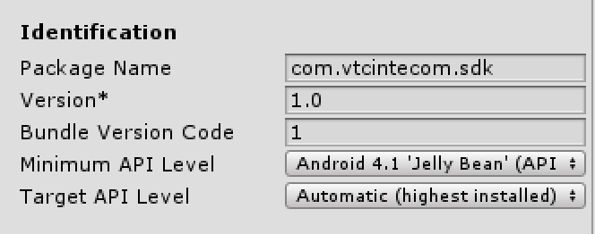
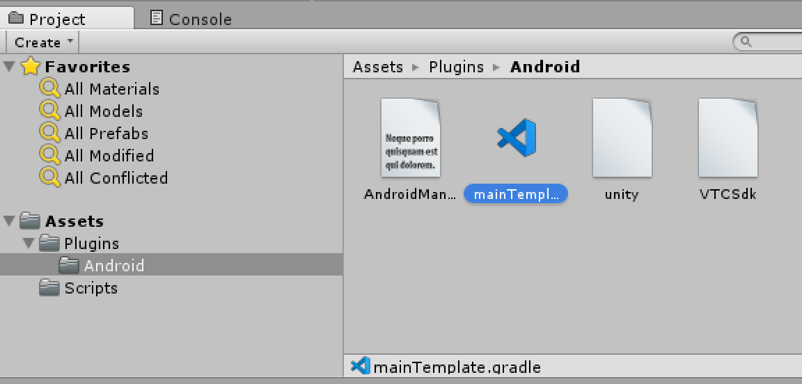
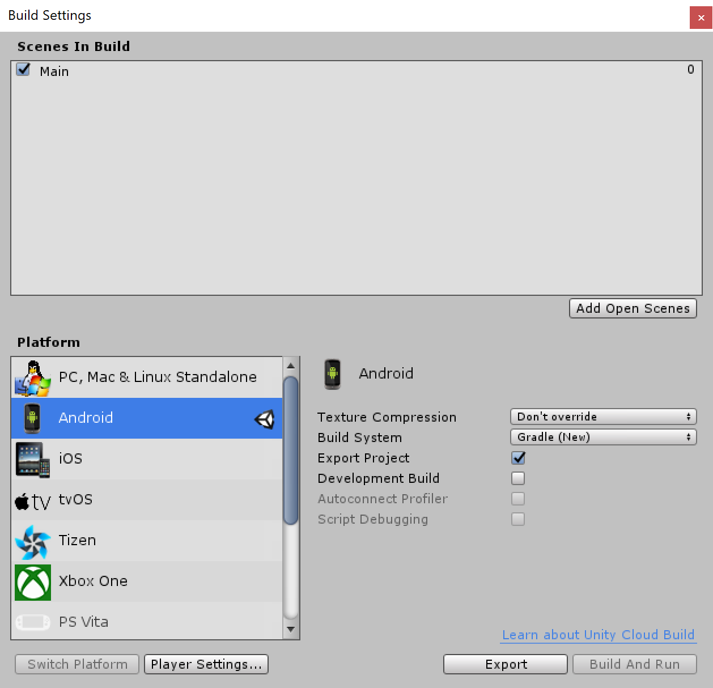

# **SDK for Unity 5.6.x**

## **Table of Content**
* [**Tools**](#Tools)
* [**Android Plugin**](#Android-Plugin)
    * [**Setting**](#Setting)
    * [**AndroidManifest**](#AndroidManifest)
    * [**Build Gradle**](#Build-Gradle)
    * [**Export Project**](#Export-Project)
* [**Source code for Unity**](#Source-code-for-Unity)
    * [**SetEnvironment**](#SetEnvironment)
    * [**StartSDK**](#StartSDK)
    * [**Implement interface**](#Implement-interface)
    * [**SignIn**](#SignIn)
    * [**SignOut**](#SignOut)
* [**Q&A**](#Q&A)

### **Tools**

* [Unity **5.6.5p1**](https://unity3d.com/unity/qa/patch-releases/5.6.5p1)
* [Android Studio **3.5.2**](https://developer.android.com/studio)

### **Android Plugin**

* #### **Setting**

    * Choose Minimum API Level: `Android 4.1 'Jelly Bean'`
    * Choose Target API Level: `Automatic (highest installed)`

    

    Copy 4 files: [AndroidManifest.xml](./sdkdemo/Assets/Plugins/Android/AndroidManifest.xml), [mainTemplate.gradle](./sdkdemo/Assets/Plugins/Android/mainTemplate.gradle), [unity.aar](./sdkdemo/Assets/Plugins/Android/unity.aar), [VTCSdk.aar](./sdkdemo/Assets/Plugins/Android/VTCSdk.aar) into the `Assets/Plugin/Android` folder as the below image:

    

* #### **AndroidManifest**

    Use the template to override `AndroidManifest.xml` file generated by Unity.

    [AndroidManifest.xml](./sdkdemo/Assets/Plugins/Android/AndroidManifest.xml)

    Reference link: [android-manifest](https://docs.unity3d.com/560/Documentation/Manual/android-manifest.html)

* #### **Build Gradle**

    Use the template to override `gradle.build` file generated by Unity.

    [mainTemplate.gradle](./sdkdemo/Assets/Plugins/Android/mainTemplate.gradle)

    Please without modify variables in the `**` symbols, else Unity will export the `build.gradle` file incorrect.

    Reference link: [android-gradle-overview](https://docs.unity3d.com/560/Documentation/Manual/android-gradle-overview.html)

* #### **Export Project**

    

### **Source code for Unity**

Copy [SDKManager.cs](./sdkdemo/Assets/Scripts/SDKManager.cs) into the `Scripts` folder.

* #### **SetEnvironment**
    ```cs
    SDKManager.SetEnvironment (SDKManager.ENVIRONMENT_SANDBOX);
    ```

* #### **StartSDK**
    ```cs
    void StartSDK() {
        #if UNITY_ANDROID

        SDKManager.SetEnvironment (SDKManager.ENVIRONMENT_SANDBOX);

        using (AndroidJavaClass unityPlayer = new AndroidJavaClass("com.unity3d.player.UnityPlayer")) {
            using (AndroidJavaObject activity = unityPlayer.GetStatic<AndroidJavaObject>("currentActivity")) {
                SDKManager.InitStartSDK (activity);
                SDKManager.SetClientId (<CLIENT_ID>);
                SDKManager.SetClientSecret (<CLIENT_SECRET>);
            }
        }

        #endif
    }
    ```

    Please contact we to get two values below:
    * CLIENT_ID
    * CLIENT_SECRET

* #### **Implement interface**

    Implement `IOnActivityResult` interface to receive result from the `SDKManager.cs`.

    ```csharp
    public class Main : MonoBehaviour, IOnActivityResult {

        public void onMessage(string message, int requestCode) {
            
        }

    }
    ```

* #### **SignIn**
    ```csharp
    #if UNITY_ANDROID

    public void onMessage(string message, int requestCode) {
        if (requestCode == SDKManager.SIGNIN_CODE) {
            Debug.Log("ACCOUNT NAME: " + SDKManager.vtcUser.accountName);
            Debug.Log("ACCOUNT ID: " + SDKManager.vtcUser.accountId);
            Debug.Log("VCOIN BALANCE: " + SDKManager.vtcUser.vcoinBalance);
        }
    }

    #endif

    public void SignIn() {
        #if UNITY_ANDROID

        using (AndroidJavaClass unityPlayer = new AndroidJavaClass("com.unity3d.player.UnityPlayer")) {
            using (AndroidJavaObject activity = unityPlayer.GetStatic<AndroidJavaObject>("currentActivity")) {
                SDKManager.SignIn (activity, this);
            }
        }

        #endif
    }
    ```

* #### **SignOut**
    ```csharp
    public void SignOut() {
        #if UNITY_ANDROID
        
        SDKManager.SignOut();		
        
        #endif
    }
    ```

### **Q&A**

1. **Q:** Why need export to Android project?

    **A:** VTCSdk library need new version of gradle with more features than version 2.1.0 default of Unity.

2. **Q:** Why use gradle version `3.1.4`?
    
    **A:** Because the versions later conflict with Android manifest file generated by the `Unity 5.6.x`.

3. **Q:** Why need use `unity.aar` and `VTCSdk.aar` together?
    
    **A:** While `VTCSdk.aar` main focus on native Android then `unity.aar` is the bridge plugin to Unity, it support callback method instead `onActivityResult` when sign in or payment.
    
    `com.software.intecom.vtc.unity.UnityActivity` in `unity.aar` will receive `onActivityResult` from `VTCSdk.aar` then send message to Unity over callback method. **Use `unity.aar` developer don't must extends or modify `UnityPlayerActivity` class**.

    Remember add declare the line `<activity android:name="com.software.intecom.vtc.unity.UnityActivity" android:theme="@android:style/Theme.Translucent.NoTitleBar"></activity>` in the `AndroidManifest.xml` file.

4. **Q:** Why need choose Target API Level is Automatic?

    **A:** Because the `Unity 5.6.x` only support max level is 25 (`Android 7.1 (API Level 25)`) to select, in while Google Play require must target at least [Android 9 (API level 28)](https://developer.android.com/distribute/best-practices/develop/target-sdk)
