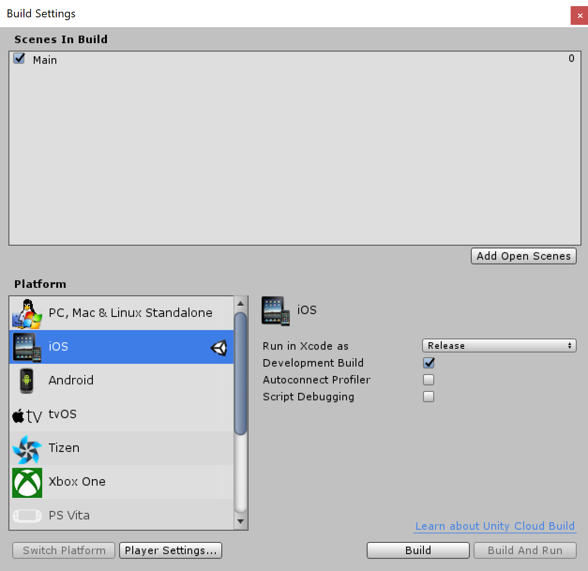

# **SDK for Unity 5.6.x**

## **Table of Content**
* [**Tools**](#Tools)
* [**Demo**](#Demo)
* [**iOS Plugin**](#iOS-Plugin)
    * [**Player Settings**](#Player-Settings)
    * [**Library**](#Library)
    * [**VTCSdk configuration**](#VTCSdk-configuration)
    * [**Export Project**](#Export-Project)
* [**Unity code**](#Unity-code)
    * [**InitStartSDK**](#InitStartSDK)
    * [**DelegateMessage**](#DelegateMessage)
    * [**SignIn**](#SignIn)
    * [**SignOut**](#SignOut)
* [**Xcode**](#Xcode)
    * [**didFinishLaunchingWithOptions**](#didFinishLaunchingWithOptions)
    * [**openURL**](#openURL)
* [**Q & A**](#Q-&-A)

### **Tools**

* [Unity **5.6.5p1**](https://unity3d.com/unity/qa/patch-releases/5.6.5p1)
* [Xcode **11.2**](https://apps.apple.com/app/xcode/id497799835)

### **Demo**
Checkout Git: [https://github.com/lannes/sdk-unity.git](https://github.com/lannes/sdk-unity.git)

Open `sdkdemo` project in the Unity 5.6.x.

### **iOS Plugin**

* #### **Player Settings**
    * Target minimum iOS version: 9.0

* #### **Library**
    * Copy `UnityBridge.h`, `UnityBridge.mm` into the `Assets/Plugins/iOS` folder.
    * Copy [BuildPostProcessor.cs](./sdkdemo/Assets/Scripts/Editor/BuildPostProcessor.cs) into the `Scripts/Editor` folder.
    * Copy `NativeAssets` directory to the Unity project.
    * Folder struct:
    ```
    + Assest
    |   + Plugins
    |   |   + Android
    |   |   + iOS
    |   |   |   + UnityBridge.h
    |   |   |   + UnityBridge.mm
    |   + Scripts
    |   |   + Editor
    |   |   |   - BuildPostProcessor.cs
    |   |   - SDKManager.cs
    + Library
    + NativeAssets
    |   + VtcSDK.framework
    |   + VtcSDKResource.bundle
    |   + VtcSDK-Info.plist
    |   + sdkconfig.xml
    + ProjectSettings
    ```
* #### **VTCSdk configuration**

    The `VtcSDK-Info.plist` file in `NativeAssets` directory.

    ```xml
    <?xml version="1.0" encoding="UTF-8"?>
    <!DOCTYPE plist PUBLIC "-//Apple//DTD PLIST 1.0//EN" "http://www.apple.com/DTDs/PropertyList-1.0.dtd">
    <plist version="1.0">
    <dict>
        <key>APPSFLYER_DEV_KEY</key>
        <string>4toAa4UsXTiSELM98xse83</string>
        <key>APPSTORE_ID</key>
        <string>1465214241</string>
        <key>VTC_APP_NAME</key>
        <string>FinalBlade</string>
        <key>UTM_STRING</key>
        <string></string>
        <key>DIRECT_VERSION</key>
        <false/>
        <key>VTC_APP_ID</key>
        <string></string>
        <key>VTC_APP_SECRET</key>
        <string></string>
        <key>LANGUAGE</key>
        <string>vie</string>
        <key>VTC_APP_ID_EN</key>
        <string></string>
    </dict>
    </plist>
    ```

    Please contact us to get the values below:
    * VTC_APP_ID
    * VTC_APP_SECRET
    * VTC_APP_ID_EN

    Set field values before use Unity to build Xcode project.

* #### **Export Project**

    

### **Unity code**

Copy [SDKManager.cs](./sdkdemo/Assets/Scripts/SDKManager.cs) into the `Scripts` folder.

* #### **InitStartSDK**
    ```cs
    void StartSDK() {
        #if UNITY_IOS
        // You must call set environment in UnityAppController.mm
        SDKManager.InitStartSDK();
        #endif
    }
    ```
 
* #### **DelegateMessage**
    ```cs
    public class Main : MonoBehaviour {
        #if UNITY_IOS
        [MonoPInvokeCallback(typeof(SDKManager.DelegateMessage))] 
        public static void onMessage(string message, int requestCode) {
        }
        #endif
    }
    ```

* #### **SignIn**
    ```cs
    #if UNITY_IOS
	[MonoPInvokeCallback(typeof(SDKManager.DelegateMessage))] 
 	public static void onMessage(string message, int requestCode) {
		if (requestCode == SDKManager.SIGNIN_CODE) {
			try {
				SDKManager.vtcUser = VTCUser.CreateFromJSON(message);
				Debug.Log("ACCOUNT NAME: " + SDKManager.vtcUser.accountName);
				Debug.Log("ACCOUNT ID: " + SDKManager.vtcUser.accountId);
				Debug.Log("VCOIN BALANCE: " + SDKManager.vtcUser.vcoinBalance);
			} catch (Exception e) {
				
			}
		}
 	}
    #endif

    public void SignIn() {
        #if UNITY_IOS
        SDKManager.SignIn(onMessage);
        #endif
    }
    ```

* #### **SignOut**
    ```cs
    public void SignOut() {
        #if UNITY_IOS
        SDKManager.SignOut();
        #endif
    }
    ```

### **Xcode**

Edit `UnityAppController.mm` as below:

* #### **didFinishLaunchingWithOptions**

    ```objc
    #import <VtcSDK/VtcSDK.h>

    - (BOOL)application:(UIApplication*)application didFinishLaunchingWithOptions:(NSDictionary*)launchOptions
    {
        // ...

        [SDKManager defaultManager].isSandbox = YES;
        [SDKManager defaultManager].ignoreCaptcha = NO;
        [SDKManager defaultManager].isSaveAccessToken = YES;
        [SDKManager handleApplication:application didFinishLaunchingWithOptions:launchOptions];
        return YES;
    }
    ```
        
    Environment
    * **Sandbox**: `[SDKManager defaultManager].isSandbox = YES`
    * **Live**: `[SDKManager defaultManager].isSandbox = NO`
    
* #### **openURL**

    ```objc
    - (BOOL)application:(UIApplication*)application openURL:(NSURL*)url sourceApplication:(NSString*)sourceApplication annotation:(id)annotation
    {
        return [SDKManager handleApplication:application openURL:url sourceApplication:sourceApplication annotation:annotation];
    }
    ```

### **Q & A**

1. **Q:** What is `BuildPostProcessor.cs` file? 

    **A:** `BuildPostProcessor` is a build script, it will support you add libraries and frameworks necessary automatic. It also add some setting for `Xcode` project.

2. **Q:** How to use `BuildPostProcessor.cs` file?

    **A:** `BuildPostProcessor` support methods as below:
    * `AddFramework(string framework)`
    
        e.g. AddFramework("CoreData.framework");
    * `AddUsrLib(string framework)`
    
        e.g. AddUsrLib("libz.dylib");
    * `AddExternalFramework(string path, string framework)`
    
        e.g. AddExternalFramework(Application.dataPath + "/../NativeAssets", "VtcSDK.framework");
    * `AddFile(string path, string file)`
    
        e.g. AddFile(Application.dataPath + "/../NativeAssets", "VtcSDK-Info.plist");
    * `UpdatePlist()`
    
        e.g. rootDict.CreateArray("UIBackgroundModes").AddString("remote-notification");
    
    * `AddFrameworkToEmbed(string path, string frameworkName)`
        
        e.g. AddFrameworkToEmbed(buildPath, "VtcSDK.framework");

3. **Q:** Is `VTCSdk` run on simulator?

    **A:** Please contact us to get `VTCSdk` version for simulator.

4. **Q** How to solve if occur error `MapFileParser.sh: Permission denied` while build with `Xcode`?

    **A:** Run command below:
    ```sh
    chmod +x /path/to/MapFileParser
    ```

